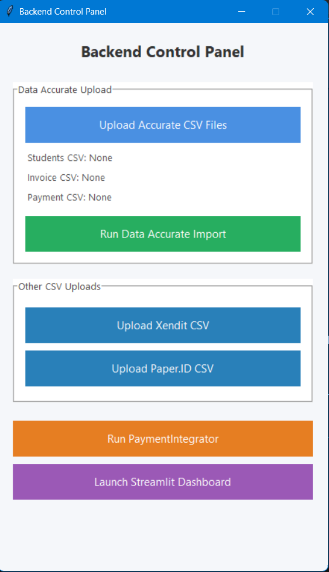

# ar-recon
# Account Receivable Reconciliation Middleware and Dashboard

[](https://www.python.org/)

## Project Summary

This project centralizes student payment data from multiple sources (Accurate, Xendit, PaperID) into one PostgreSQL database and provides a dashboard for monitoring accounts receivable and payments. It automates payment reconciliation and offers visualization tools to improve financial tracking.
---

## Features

- Connects to multiple PostgreSQL databases for Accurate, Xendit, and PaperID payments.
- Prevents duplicate payment records based on unique references.
- Updates accounts receivable with payment information and outstanding balances.
- Streamlit dashboard for visualizing invoice aging, payment methods, and detailed reports.
- Tkinter GUI for uploading CSV files and running backend processes easily.

---

## Project Structure

| File                | Description                                      |
|---------------------|------------------------------------------------|
| `app.py`            | Main payment integration middleware class       |
| `ar_dashboard2.py`  | Streamlit dashboard for AR and payment analysis |
| `data_accurate.py`  | Data ingestion script for Accurate CSV data     |
| `payment_xendit.py` | Data ingestion script for Xendit CSV data       |
| `payment_paperID.py`| Data ingestion script for PaperID CSV data      |
| `recon.py`          | Tkinter-based backend control panel GUI         |

---

## Requirements

### Software

- Python 3.8 or higher
- PostgreSQL 12 or higher
- Git (optional, for version control)

### Python Packages

Install required Python packages via pip:

```bash
pip install -r requirements.txt
```

Example `requirements.txt` content:

```
psycopg2-binary
streamlit
pandas
sqlalchemy
matplotlib
seaborn
tk
```

---

## Database Setup

You need to create and configure three PostgreSQL databases for this project:

| Database Name   | Purpose                          | Tables Required                      |
|-----------------|---------------------------------|------------------------------------|
| `dummy_accurate`| Stores Accurate invoices & payments | `students`, `piutang_tagihan`, `penerimaan_penjualan` |
| `dummy_xendit`  | Stores Xendit payment data       | `payments`                         |
| `dummy_paperID` | Stores PaperID payment data      | `payments`                         |
You can change the name of the database as you want, but you must change the code to connect to the database
### Example Table Schemas

- **students**

| Column      | Type         | Description                |
|-------------|--------------|----------------------------|
| id_student  | VARCHAR      | Unique student identifier  |
| name        | VARCHAR      | Student name               |
| email       | VARCHAR      | Student email              |

- **piutang_tagihan** (Accounts Receivable)

| Column             | Type       | Description                 |
|--------------------|------------|-----------------------------|
| nomor_invoice      | VARCHAR    | Invoice number              |
| id_student         | VARCHAR    | Student ID (foreign key)    |
| tanggal            | DATE       | Invoice date                |
| total              | NUMERIC    | Invoice total amount        |
| jumlah_pembayaran  | NUMERIC    | Amount paid                 |
| status             | VARCHAR    | Invoice status              |
| tanggal_update     | DATE       | Last update date            |

- **penerimaan_penjualan** (Payments)

| Column            | Type       | Description                 |
|-------------------|------------|-----------------------------|
| metode_pembayaran | VARCHAR    | Payment method              |
| nomor_penerimaan  | VARCHAR    | Payment receipt number      |
| tanggal           | DATE       | Payment date                |
| jumlah            | NUMERIC    | Payment amount              |
| nomor_invoice     | VARCHAR    | Related invoice number      |
| id_student        | VARCHAR    | Student ID                  |

- **payments** (For Xendit and PaperID)

| Column             | Type       | Description                 |
|--------------------|------------|-----------------------------|
| id_xendit_payment  | VARCHAR    | Unique Xendit payment ID    |
| id_paper_payment   | VARCHAR    | Unique PaperID payment ID   |
| nomor_invoice      | VARCHAR    | Invoice number              |
| tanggal            | DATE       | Payment date                |
| jumlah             | NUMERIC    | Payment amount              |
| id_student         | VARCHAR    | Student ID                  |

> Adjust schemas as needed to match your actual database structure.

---

## How to Use

### 1. Clone the Repository

```bash
git clone https://github.com/yourusername/your-repo.git
cd your-repo
```

### 2. Set Up Python Environment and Install Dependencies

```bash
python -m venv venv
source venv/bin/activate  # On Windows: venv\Scripts\activate
pip install -r requirements.txt
```

### 3. Configure Database Connections

Edit the `config.py` file to add your PostgreSQL connection details for each database:
You must make a config.py so the middleware can connect to the database. Here is my code for config.py:
```python
DATABASES = {
    'accurate': {
        'host': 'localhost', #(i put it on local host in this case)
        'port': 5432,
        'database': 'dummy_accurate',
        'user': 'postgres',
        'password': 'xxxx' #(you can put the database password here)
    },
    'xendit': {
        'host': 'localhost', #(i put it on local host in this case)
        'port': 5432,
        'database': 'dummy_xendit',
        'user': 'postgres',
        'password': 'xxxx' #(you can put the database password here)
    },
    'paperid': {
        'host': 'localhost', #(i put it on local host in this case)
        'port': 5432,
        'database': 'dummy_paperID',
        'user': 'postgres',
        'password': 'xxxx' #you can put the database password here
    }
}
```

## Usage Example

1. run the app.py
```bash
python recon.py
```


2. Upload CSV files via the Tkinter GUI:
click the "import csv" to upload the CSV file to database. For accurate database it have 3 CSV you can store 1 or all of these 3 csv:
   a. students to update list of student
   b. invoice to update list invoice
   c. accurate_payments to update payments beside xendit and paperID.
after you upload 1 or all of 3 CSV for accurate click "import accurate data" button.
but for upload payment to xendit database and paperID database you only 1 CSV so when you choose the CSV it will uploaded itself to xendit or paper I'd database in your postgress.

3. Run the payment integration process:
click the "run paymentintegrator" button to run the middleware sync payments and update accounts receivable

4. Launch the Streamlit Dashboard

Visualize reports and analytics with:
Click "Launch Streamlit Dashboard" Menu

---

## Notes

- Make sure PostgreSQL servers are running and accessible.
- CSV files should be formatted according to the ingestion scripts' expectations.
- The middleware handles duplicate payments by checking unique payment IDs.
- The Streamlit dashboard caches data for 10 minutes to improve performance.

---
---
## Contact

For questions or support, please contact: ibay.indra@gmail.com

---

**Happy coding!** 🚀

